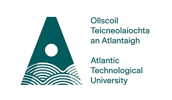

# Machine Learning and Statistics Project </n>

# Project for module achine Learning and Statistics  Winter 2022 </n>

## Author: Fionn McCarthy - G00301126 </n>
---
This is my repository for the project assessment in the module. This project consists jupyter notebooks from continuous assessment exercises that were detailed in lectures by Dr. Ian Mcloughlin and these can be found in the 'practical' folder of this github repository. The module also consisted of a further project notebook which entailed me  re-creating the Keras time series anomaly detection wesbite page at this <a href="https://keras.io/examples/timeseries/timeseries_anomaly_detection/">link</a> and explaining concepts on the site in order to give an insight into the topic. 

---
### Practicals
1. Statistics topic exercises - 01-statistics-exercises.ipynb.
2. Models topic exercises - 02-models-exercises.ipynb.
3. Parameters topic exercises - 03-parameters-exercises.ipynb.
---
### Project
1. Time Seriers Anomaly Detection Notebook - anomaly-detection.ipynb.